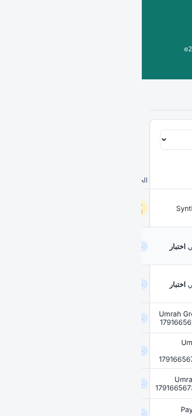
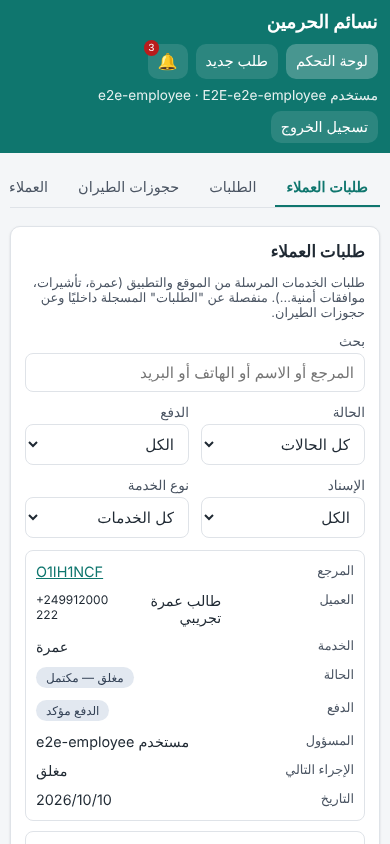
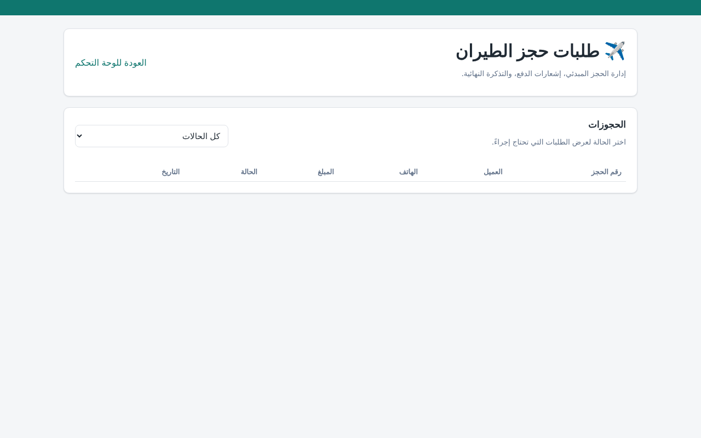
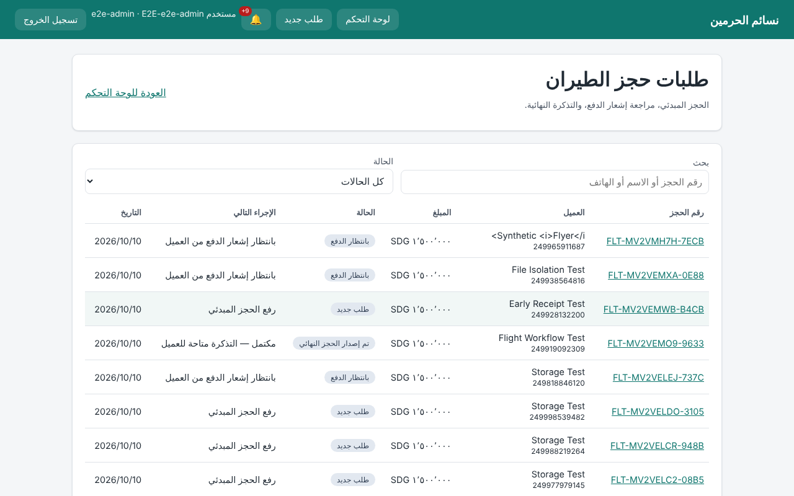
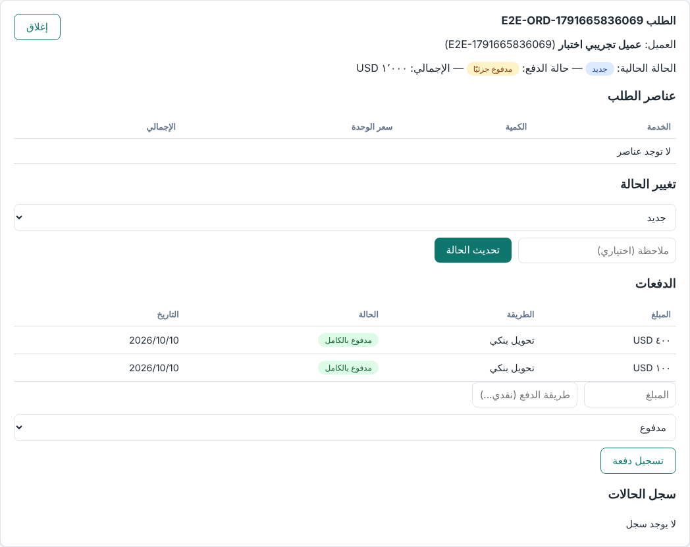
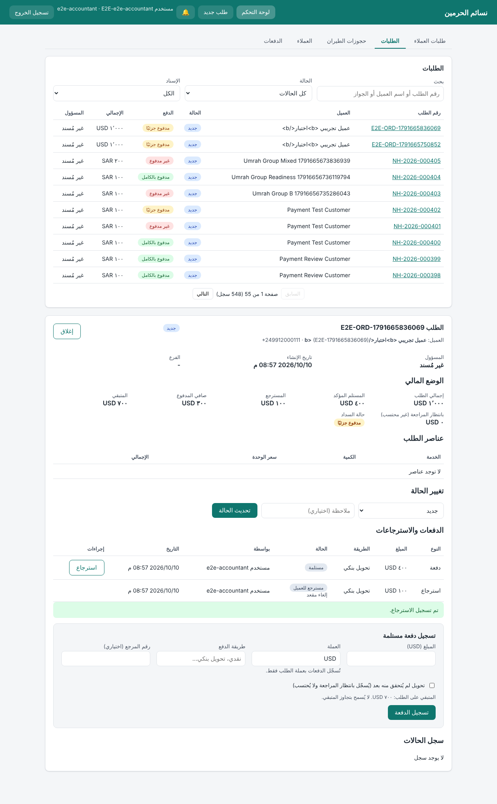

# Admin remediation: before/after screenshots

The screenshots were taken with Chromium on the local server, using **synthetic data only**:
- **Before**: base commit `4bb8a73` (PR #81).
- **After**: integration branch `ccr-1bb2ad1a-sa8ylm`.

| Before | After |
|---|---|
|  EMPLOYEE on a phone: only Orders and Customers. Customer requests are unreachable. |  Customer requests, Orders, Flight bookings and Customers. Rows show as cards on small screens. |
|  Flight bookings page: the CSP blocks the inline script, so the page is empty. |  External scripts, with search and filters. |
|  Payment form: no currency is sent (the server assumes SAR), a free "status" select (PARTIAL was never counted), and a refund row is shown as "paid". |  Settlement in the order's currency, payments and refunds as separate rows, and an overpayment guard. |

Also captured in the after state:
- `after-request-detail.png`: the full customer-request detail.
- `after-database-outage-retry.png`: when the database is down, the session is kept and a retry is offered.
